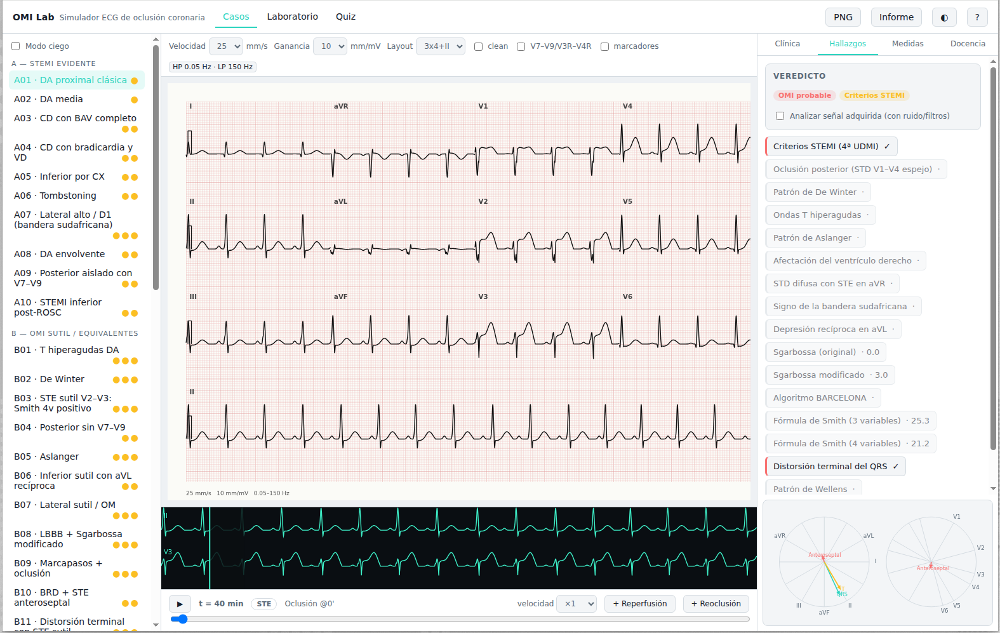

# OMI Lab — Simulador ECG de oclusión coronaria

Simulador web de ECG de 12 derivaciones para el diagnóstico de oclusión coronaria aguda (OMI).
Un motor vectorial 3D genera latidos fisiológicos con lesión isquémica direccionada, evolución
temporal y artefactos de adquisición; una capa de análisis aplica reglas cuantitativas
STEMI/OMI reales sobre la señal medida. Pensado para docencia y entrenamiento diagnóstico.



## Qué incluye

- **Motor vectorial 3D** → proyección a 12+ derivaciones (V7–V9, V3R–V4R) vía matriz tipo Dower.
- **50 casos clínicos** en 6 series (STEMI evidente, OMI sutil/equivalentes, subendocárdica/aVR,
  imitadores, seriados dinámicos, artefactos de adquisición).
- **Reglas cuantitativas**: stemi-udmi4, de Winter, T hiperaguda, STD posterior, Aslanger,
  bandera sudafricana, aVR/STD difusa, afectación VD, Sgarbossa original y modificado,
  BARCELONA, Smith 3v/4v, distorsión terminal del QRS, Wellens, Q patológica y un
  compuesto `omi-composite`.
- **Evolución temporal**: línea de tiempo con oclusión, reperfusión y reoclusión.
- **Adquisición realista**: wander, EMG, red 50/60 Hz, artefactos de movimiento, filtros
  paso-alto/bajo y errores de colocación de electrodos.
- **Laboratorio**: editor completo del escenario (fuentes de lesión, ritmo, conducción,
  adquisición, semilla) con importación/exportación JSON.
- **Quiz ciego**: decisiones secuenciales con puntuación, racha y sensibilidad/especificidad.
- **Calipers** de medición sobre el papel, **vista vectorial** (ejes QRS/T y vectores de lesión),
  exportación PNG e informe Markdown.

## Inicio rápido

```bash
nvm use            # Node 22 (.nvmrc)
npm ci
npm run dev        # http://localhost:5173
npm run check      # format + lint + typecheck + tests + build
```

## Arquitectura

```
src/engine    Simulación: dipolo del latido, lesión, ritmo, adquisición (MODEL.md)
src/analysis  Medición por latido dominante + reglas diagnósticas (Finding)
src/cases     Biblioteca de 50 casos con viñetas, expectativas y referencias
src/ui        Vanilla TS + Canvas 2D: store, renderer, paneles, modos
tools         CLI de inspección (dump-beat, dump-cases)
docs          MODEL.md (especificación del motor), CASES.md, research/ (revisión científica)
```

Ver [docs/ARCHITECTURE.md](docs/ARCHITECTURE.md), [docs/MODEL.md](docs/MODEL.md),
[docs/CASES.md](docs/CASES.md) y la revisión en [docs/research/revision-ecg-sca.md](docs/research/revision-ecg-sca.md).

## Atajos de teclado

| Tecla             | Acción                                    |
| ----------------- | ----------------------------------------- |
| `Espacio`         | Reproducir / pausar la evolución temporal |
| `←` / `→`         | t −1 / +1 minuto                          |
| `Shift` + `←`/`→` | t −10 / +10 minutos                       |
| `c`               | Alternar traza limpia (verdad)            |
| `[` / `]`         | Caso anterior / siguiente                 |
| `Esc`             | Limpiar calipers                          |

## Calidad

TypeScript estricto, ESLint, Prettier, Vitest (+ fast-check en propiedades), tests de
aceptación por caso y por regla, CI en GitHub Actions y despliegue estático en Pages.

## Limitaciones y aviso

Herramienta **educativa**: no es un dispositivo médico. Las señales son sintéticas (modelo
dipolar de corazón único); las reglas solo están validadas en sus poblaciones originales.
No usar para decisiones clínicas.

## Licencia

MIT — ver [LICENSE](LICENSE).
